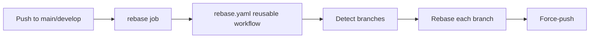

# Rebase Branches After Main/Develop Update

## Overview

This workflow keeps your feature, fix, and other topic branches up to date with the latest changes from `main` or `develop`. It leverages a reusable workflow from the ProductDNA DevOps repository to ensure consistent rebasing practices across all repositories.

## Workflow File

`.github/workflows/rebase.yaml`

## Triggers

The workflow is triggered by:

- **Push events** on:
  - `main` branch
  - `develop` branch

## Permissions

- `contents: write` - Required to rebase and force-push branches

## Prerequisites

The workflow uses the **organization-level GitHub App** `pdna-rebase` for authentication. This app is already configured at the organization level, so no per-repository setup is required.

### For Repository Administrators

If this is a new repository, ensure:

1. **Install the GitHub App**: The `pdna-rebase` app must be installed on this repository
   - Go to https://github.com/organizations/ProductDNA-CH/settings/installations
   - Find the `pdna-rebase` app installation
   - Add this repository to the installation

2. **Bypass Rulesets**: Add the `pdna-rebase` app to the bypass list of your repository's rulesets to allow it to force-push rebased branches
   - Go to repository **Settings > Rules > Rulesets**
   - Edit the ruleset that protects your branches
   - Add `pdna-rebase[bot]` to the bypass list

### Organization Variables and Secrets

The workflow uses organization-level configuration (no per-repository setup needed):

| Type | Name | Description |
|------|------|-------------|
| Variable | `GH_APP_REBASE_ID` | App ID of the `pdna-rebase` GitHub App |
| Secret | `GH_APP_REBASE_PRIVATE_KEY` | Private key of the `pdna-rebase` GitHub App |

## Jobs

### `rebase` Job

```yaml
uses: ProductDNA-CH/devops/.github/workflows/rebase.yaml@main
with:
  app-id: ${{ vars.GH_APP_REBASE_ID }}
secrets:
  private-key: ${{ secrets.GH_APP_REBASE_PRIVATE_KEY }}
```

Uses the centralized `rebase.yaml` reusable workflow from the ProductDNA DevOps repository.

## Reusable Workflow Benefits

By using the centralized reusable workflow, this workflow gains:

1. **Consistency**: All repositories follow the same rebasing process
2. **Maintainability**: Updates to the rebasing logic are centralized in one location
3. **Simplified Configuration**: No per-repository GitHub App setup required
4. **Best Practices**: The reusable workflow implements organization-wide standards for:
   - Branch detection and filtering
   - Safe rebase operations
   - Conflict handling
   - Authentication with GitHub App tokens

## How It Works

The reusable workflow (`ProductDNA-CH/devops/.github/workflows/rebase.yaml`) handles:

1. **Trigger**: Runs on every push to `main` or `develop`

2. **Branch Detection**:
   - On `main` update: finds `hotfix/*`, `release/*`, and `develop`
   - On `develop` update: finds `feat/*`, `fix/*`, `docs/*`, `style/*`, `refactor/*`, `perf/*`, `test/*`, `build/*`, `ci/*`, `chore/*`, `revert/*`

3. **Rebase Process** (for each detected branch):
   - Checks out the branch
   - Rebases it onto the updated base (`main` or `develop`)
   - Force-pushes the rebased branch

4. **Authentication**: Uses the `pdna-rebase` GitHub App token for authentication and commit attribution

## Workflow Dependencies



## Best Practices

- **Force-pushing rewrites branch history**: Ensure collaborators are aware and pull the latest changes
- **Conflict handling**: The workflow will fail if rebasing encounters conflicts; resolve them manually
- **App permissions**: The `pdna-rebase` app has minimal permissions (only `Contents: Read & Write`)
- **Centralized maintenance**: Keep the reusable workflow up-to-date in the DevOps repository

## Troubleshooting

### Rebase Fails with Conflicts
- The workflow cannot auto-resolve merge conflicts
- Manually rebase the branch: `git rebase main` (or `develop`)
- Resolve conflicts and force-push: `git push --force-with-lease`

### App Permission Denied
- Verify the `pdna-rebase` app is installed on this repository
- Check that the app has `Contents: Read & Write` permission
- Ensure the app is in the bypass list of branch protection rulesets

### Workflow Not Triggered
- Verify the workflow file is on the `main` or `develop` branch
- Check that pushes to these branches are not blocked
- Review GitHub Actions logs for any errors

### Branches Not Being Rebased
- Check that branch names match the expected patterns (e.g., `feat/*`, `fix/*`)
- Verify branches exist and are not already up-to-date
- Review the reusable workflow logs for branch detection output

## Related Documentation

- [Reusable Workflow: rebase.yaml](https://github.com/ProductDNA-CH/devops/tree/main/.github/workflows)
- [GitHub Apps Documentation](https://docs.github.com/en/apps)
- [Git Rebase Best Practices](https://git-scm.com/book/en/v2/Git-Branching-Rebasing)
